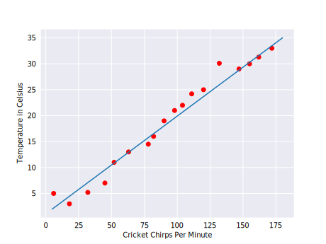

## Terminologia importante para machine learning

### Labels

Uma label é o que vamos prever, a variável **y** em uma regressão linear simples. Ex: futuro preço de trigo, o tipo de animal presente em uma foto.

### Features

Uma feature é a variável de input, a vriável x em uma regressão linear simples. Ex: um projeto simples pode utilizar uma feature simples enquanto um grande pode usar milhões de features. Ex: palavras de um texto

### Models

Define a relação entre feature e label. Ex: uma model de detecção de spam pode associar uma certa feature com "spam".

- Treinar significar criar ou aprender a model. Isto é, você mostra para a model determinados exemplos classificados (labeled) e ativa a model para gradualmente aprender a relação entre features e labels
- Inferência significa aplicar a model treinada a exemplos não classificados (unlabeled). Isto é, você usa a model já treinada para fazer predições úteis (y'). Ex: Durante a inferência, você pode prever um determinado valor médio para exemplos não classificados

### Regressão vs Classificação

- Uma model de regressão prevê valores contínuos. Por exemplo, models de regressão fazem previsões que respondem as seguintes questões:
    - Qual o valor para uma casa na Califórnia?
    - Qual a probabilidade de o usuário clicar na propaganda?
- Uma model de classificação prevê valores discretos. Por exemplo, uma model de classificação faz previsões que respondem perguntas como:
    - O mensagem do email é spam ou não?
    - A imagem é um cachorro, um gato ou um hamster?

## Transgressão linear

O gráfico mostra que junto com a temperatura, também crescem o número dos grilos. Como é uma relação linear, podemos desenhar uma linha reta para aproximar essa relação.

Não é uma linha muito fiel, mas consegue esboçar a relação entre temperatura e grilos. Usando a equação de uma reta, você pode escrever a relação como:

$$y = mx + b$$

- y = temperatura em celsius (o valor que estamos tentando prever)
- m = a inclinação da reta
- x = o número de grilos/minuto (o valor da feature de entrada)
- b = a interceptação de y